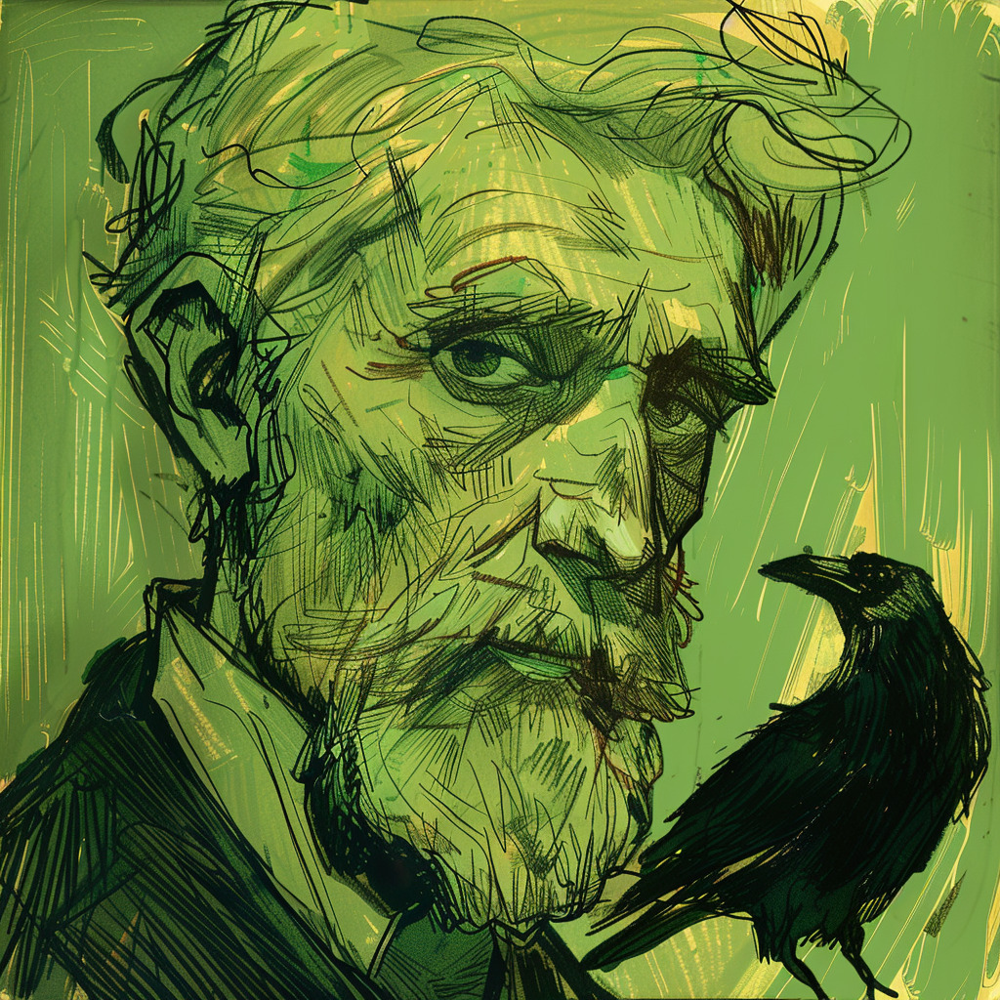
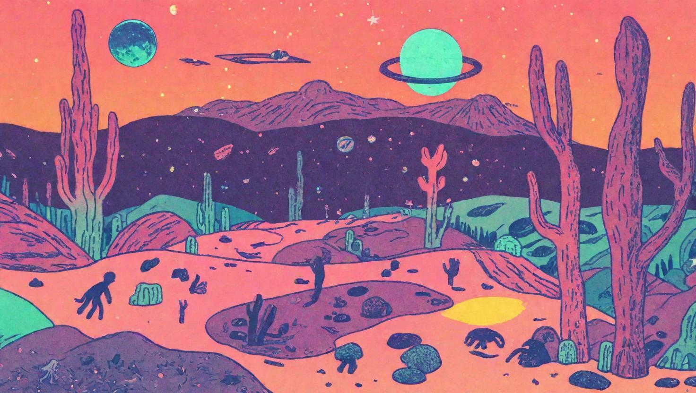


meant for purely aesthetic purposes, I do not intend to replace any artists.

--
---

<!-- 

    

    

      
    

    

      
    

    

      
    

    

      
    

    

      
    

    

      
    

    

      
    

    

      
    

    

      
    

    

      
    

    

      
    

    

      
    

    

      
    

    

      
    

  

-->













---